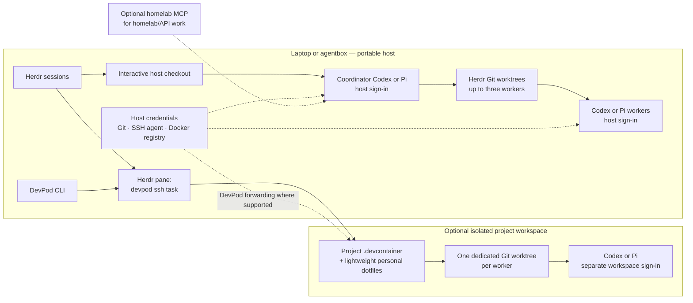

# Fedora Sway and CLI Dotfiles

Portable configuration for a Fedora Sway desktop and a headless CLI host.
Chezmoi manages configuration and setup scripts; Mise manages a pinned, locked
set of shared CLI tools and the Node.js runtime. The host and DevPod use the
same global Mise config. Both host profiles get the shared shell, development
tools, Codex, Pi, Herdr, Copier, and DevPod. The `project-scaffold` skill is
available to Codex and Pi from the shared `~/.codex/skills` directory. Homelab MCP is optional; the desktop
profile adds GUI configuration.

## Install

Install Git and curl, then initialize chezmoi and select `fedora-sway` or `cli`:

```bash
sh -c "$(curl -fsLS get.chezmoi.io)" -- init --apply https://github.com/merlrwx/dotfiles.git
```

The first apply installs CLI prerequisites and the pinned tools declared in
Mise using the committed lockfile. Chezmoi's Pi setup script runs Pi's official
installer inside Mise's managed Node.js environment. The desktop profile also
installs Fedora desktop packages, the IoskeleyMono font, and Gruvbox Material
themes. The CLI profile uses no host-name-specific role.

If starting from a clone, run `./setup` from the repository. On a new machine,
sign in to Codex and Pi separately after setup. The root `install` is a
DevPod dotfiles callback; it installs a lightweight workspace setup and is not
the host setup command.

## Workflow modes

Use the same portable baseline on a laptop, at work, or on the home agentbox.
The host owns normal developer credentials. DevPod forwards supported Git,
SSH-agent, and Docker credentials to workspaces. Codex and Pi sign in separately
inside a workspace; host agent auth is never copied there. Regular project work
does not require homelab MCP.



**Interactive mode:** run an agent on the host in Herdr. Use the host checkout
and its normal credentials; start DevPod only when the project's tools require
its DevContainer.

**Herdr parallel mode:** when you explicitly ask a coordinator to delegate, the
`parallel-work` skill can launch up to three named workers in separate Git
worktrees. `agent-worker` prepares one autonomous goal per worktree, starts
Codex or Pi through Herdr, and records run metadata under
`~/.local/state/agent-runs/`. The coordinator reviews each verifier result,
collects its patch, integrates it, and then starts dependent phases. Workers do
not delegate recursively. See [parallel work](docs/parallel-work.md) for the
three modes, boundaries, and recovery steps, and [Git branches and worktrees](docs/git-branch-lifecycle.md)
for branch integration and cleanup. Coordination stays with the active agent;
there is no background scheduler.

From a coordinator already running in Herdr, a request can look like this:

```text
$autonomous-goal Implement PLAN.md. Use parallel-work isolated mode for the
independent phases, start with two workers, and keep all changes local. You may
make local integration commits to unblock dependent phases; do not push or deploy.
```

The commit sentence is needed only when dependent work must start from a
verified integration commit. Without that authority, the coordinator keeps
dependent phases pending. Herdr worktree and agent CLI details are handled by
the installed Herdr skill.

**Isolated workers in DevPod (optional):** create a DevPod workspace with a
unique ID per task, then a dedicated Git worktree inside it. This remains useful
when a project needs DevContainer tools or workspace-level isolation. Homelab
MCP is available only when separately configured and reachable; it is not
needed for portable Git or project work.

For the regular host flow, open a Herdr session and start Codex in its pane:

```bash
herdr --session codex
# In the Herdr pane:
codex
```

The Bash wrapper starts interactive Codex sessions without the shared
background daemon. This avoids feature-setting conflicts between CLI sessions
and other Codex clients; management commands such as `codex mcp` keep their
normal behavior.

Pi can use its own session too:

```bash
herdr --session pi
# In the Herdr pane:
pi
```

Pi executes tools with the permissions of the account that started it and does
not need a `--yolo` flag. Project trust controls loading project resources; it
does not grant additional operating-system permissions. Invoke skills explicitly
with `/skill:grill-me` or `/skill:herdr`. The Herdr skill requires a Herdr pane.
Bash enables Node's system certificate store so Pi can trust locally installed
homelab certificate authorities.

Both profiles include Git, SSH, curl, jq, mise, editors, terminal tools,
GitHub/GitLab CLIs, kubectl, Helm, Flux, Docker, DevPod, Codex, Pi, and Herdr.
Herdr manages host sessions and visibility. Repository DevContainer
instructions and `mise` tasks take precedence when available.

### Lightweight DevPod dotfiles

DevPod installs the same pinned global Mise tools as the host, plus the personal
shell, editor, Git defaults, and shared agent instructions. Project-specific
runtimes and platform tools remain in the project's `mise.toml` and
`.devcontainer`.

For one workspace, add the dotfiles repository when creating it:

```bash
devpod up <project-or-workspace> \
  --dotfiles https://github.com/merlrwx/dotfiles.git \
  --dotfiles-script install
```

To use this for all new workspaces in the selected DevPod context:

```bash
devpod context set-options \
  -o DOTFILES_URL=https://github.com/merlrwx/dotfiles.git \
  -o DOTFILES_SCRIPT=install
```

The workspace installer installs the same pinned global Mise tools as the host,
then adds Codex and Pi, the shared Neovim config, a small Bash overlay, Gruvbox
Material Starship settings, Git defaults, shared agent instructions, and a
minimal Codex theme config. The Codex theme is seeded only when no user config
exists. It does not install Herdr, Pi's host-only autonomous-goal extension, or
homelab MCP configuration. It never copies host agent auth or MCP files, Git,
SSH, Docker, or provider credentials. DevPod provides HTTPS Git credential
helpers, SSH agent forwarding, and Docker credential forwarding where
supported. GitHub/GitLab API CLI sign-ins and other provider credentials need
their own supported auth flow; they are not the Git credential helper.
See [DevPod dotfiles](https://devpod.sh/docs/developing-in-workspaces/dotfiles-in-a-workspace)
and [DevPod credential forwarding](https://devpod.sh/docs/developing-in-workspaces/credentials).

### Isolated Codex workers (V2)

This mode works with a normal DevPod provider, such as Docker on a laptop or
work machine. It does not require Tailscale or homelab MCP. Each worker has a
unique DevPod ID and a Git worktree inside that workspace's project checkout.
Create a fresh workspace for each task from the same repository:

```bash
repo=https://github.com/<owner>/<repo>
project=${repo##*/}
project=${project%.git}
task=api-timeouts

devpod up "$repo" \
  --id "$task" \
  --ide none \
  --dotfiles https://github.com/merlrwx/dotfiles.git \
  --dotfiles-script install
```

Start a named Herdr session on the host and connect it to that worker:

```bash
herdr --session "codex-$task"
# In the Herdr pane:
devpod ssh "$task" --workdir "/workspaces/$project"
```

Inside the project directory in the workspace shell, create the task worktree
and start Codex there:

```bash
task=api-timeouts
git fetch origin
mkdir -p .agent-worktrees
grep -Fxq '/.agent-worktrees/' .git/info/exclude || \
  printf '/.agent-worktrees/\n' >> .git/info/exclude
git worktree add ".agent-worktrees/$task" -b "agent/$task" HEAD
cd ".agent-worktrees/$task"
codex
```

Repeat with a new task name and DevPod ID for every additional worker. The
worktree is inside its workspace so the project checkout, worktree, and
DevContainer tools stay together. Codex can push branches through DevPod's
Git credential helper or forwarded SSH agent. DevPod also supports Docker
registry credential forwarding. Codex itself uses a separate workspace sign-in;
on first use run `codex login --device-auth` and finish the device flow. Its
auth stays in that workspace and is never copied from the host. See the
[Codex CLI install guide](https://learn.chatgpt.com/docs/codex/cli) and
[login reference](https://learn.chatgpt.com/docs/developer-commands).

To try Pi in a worker, run `pi` from its task worktree and use `/login` on
first start. Pi and Codex have separate workspace sign-ins; choose one harness
per worktree. See the [Pi quickstart](https://pi.dev/docs/latest/quickstart).

GitHub/GitLab API CLIs and cloud CLIs have their own authentication. If a task
needs them, install the required CLI in that project's DevContainer and use its
normal sign-in flow. Ordinary Git fetch, commit, and push remain independent
of those APIs and of homelab MCP. Herdr sees the DevPod SSH command rather than
the Codex process, so its worker-state indicator may be limited across that
SSH hop.

On a Fedora or other SELinux-enforcing Linux host, a workspace can fail with
`Permission denied` under `/workspaces` even when file ownership looks correct.
DevPod's Linux guidance is to relabel the project mount in that project's
`.devcontainer/devcontainer.json`:

```json
{
  "workspaceMount": "",
  "workspaceFolder": "/workspaces/${localWorkspaceFolderBasename}",
  "runArgs": [
    "--volume=${localWorkspaceFolder}:/workspaces/${localWorkspaceFolderBasename}:Z"
  ]
}
```

Merge these values with the project's existing DevContainer settings. Use this
SELinux-specific mount only on enforcing Linux hosts; other hosts should keep
their normal workspace mount. See [DevPod Linux troubleshooting](https://devpod.sh/docs/troubleshooting/linux-troubleshooting).

## Neovim and shared tools

The same pinned global Mise tools are available on the host and in DevPod; a
project's Mise config can add or override runtimes for that project. Common
JSON, Markdown, TOML, and YAML language support is global in Neovim, while
project-specific language extras can be added through `.lazy.lua`. fzf-lua is
the active picker. See [Neovim setup and key guide](docs/neovim.md) for search
keys, LazyVim defaults, the optional plugins, and the Mise update workflow.

## Shell, theme, and typography

The shared CLI palette is Gruvbox Material Dark Hard: it is reflected in the
Starship prompt, Bash syntax colors, Neovim, Yazi, tmux status bar, Alacritty,
and matching desktop UI themes. A fresh Codex config receives the matching
theme; existing Codex runtime configuration is preserved. Fedora Sway installs
and selects `IoskeleyMonoTerm Nerd Font Mono` for supported desktop
applications; remote terminal font rendering comes from the local terminal
client.

Bash uses ble.sh for interactive editing and completion, including syntax
highlighting, suggestions, and the navigable menu; Starship owns the prompt and
uses a portable ASCII `>` plus a parenthesized branch such as `(main)`. `cat`
uses `bat` and the `ls` family uses `lsd` when those Mise tools are installed.
Git status appears as colored labels when relevant: `+` staged, `!` modified, `?`
untracked, `^` ahead, `v` behind, and `<>` diverged; `up to date` means the
branch matches its remote. Conflicts, renames, deletions, type changes, and
stashes are named as well. Register native Bash providers in
`~/.config/bash/completions/init` with `command <tool> completion bash`; Flux
and Mise completions are loaded there when those tools are installed. Add
wrappers there when runtime candidates are missing.
At an idle prompt, Ctrl+C cancels the current line in both vi editing modes. The
`k` alias retains kubectl completion, Fabric pattern aliases are generated from
installed pattern names, and `yt` requests a video transcript. Neofetch shows a
colored cat once at interactive terminal startup (once per tmux session).
Tmux uses the matching status colors and enables terminal clipboard forwarding
where the client supports it; detach with the usual `Ctrl-b`, then `d`.

## Plan a complex change

Discuss and research the idea in ChatGPT, save a draft `PLAN.md` in the
repository, then use `/skill:grill-me` to find missing decisions and sharpen its
acceptance criteria in a Pi session. Keep that planning work separate. Start a
fresh Codex session to implement the revised plan.

See [the example plan](docs/PLAN-example.md) and
[the autonomous goal workflow](docs/autonomous-goals.md).

## Optional homelab MCP

On the home network, Codex and host-installed Pi can use the homelab MCP endpoint
for privileged homelab/API work. Each agent has a separate OAuth login and
stores its own credentials locally. The lightweight DevPod installer does not
copy MCP settings or auth, and ordinary Git/project work does not depend on this
service. Follow [Homelab MCP setup](docs/homelab-mcp.md) after connecting to the
homelab network.
